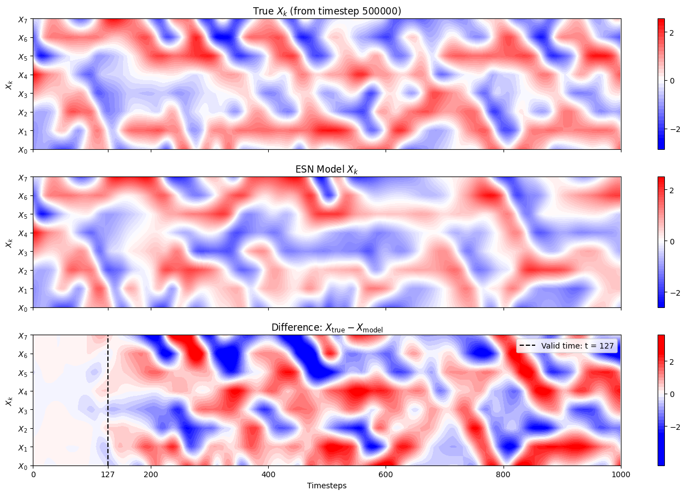

# Lorenz-96-hybrid-esn

### State Estimation of the Multi-Scale Lorenz 96 System Using a Hybrid Echo State Network and Ensemble Kalman Filter

This is a research project completed for capstone modeling course AM170B, supervised by professor Ashesh Chattopadhyay.

## Sample output for ESN model

This repository contains attempted approach on state estimation using our knowledge on Hybrid ESNs (Echo State Networks) and EnKF (Ensemble Kalman Filtering). We train model on noisy samples of the Multiscale Lorenz 96 system, generated by applying a Gaussian noise on the RK4 solver. 

The repository contains plenty scripts to help with our project:
- `data.ipynb`, a data generation script
- `enkf.ipynb`, a sample run of an Ensemble Kalman Filter
- `hybrid_rcesn.ipynb` and `new_hybrid_rcesn.ipynb`, iterations of our Hybrid Echo State Network
- `main.ipynb`, containing all the steps, tests run, and performance metrics described in our paper.
- `report.pdf`, the official report for the paper
- `final_slides.pdf`, cumulative slides describing our efforts

---

[1] Ashesh Chattopadhyay, Pedram Hassanzadeh, and Devika Subramanian. Data-driven pre-
dictions of a multiscale lorenz 96 chaotic system using machine-learning methods: reservoir
computing, artificial neural network, and long short-term memory network. Nonlinear Pro-
cesses in Geophysics, 27(3):373–389, July 2020.

[2] Ashesh Chattopadhyay, Adam Subel, and Pedram Hassanzadeh. Data-driven super-
parameterization using deep learning: Experimentation with multiscale lorenz 96 systems
and transfer learning. Journal of Advances in Modeling Earth Systems, 12(11), November
2020.

[3] Geir Evensen. The ensemble kalman filter: Theoretical formulation and practical implemen-
tation. Ocean Dynamics, 53(4):343–367, 2003.

[4] Debdipta Goswami, Artur Wolek, and Derek A. Paley. Data-driven estimation using an
echo-state neural network equipped with an ensemble kalman filter. In 2021 American
Control Conference (ACC), pages 2549–2554, 2021.

[5] NASA/GSFC. Application of the ensemble kalman filter (enkf) to lorenz’s 1963 model,
2010. Exploring Our Magnetic Earth.

[6] Jaideep Pathak, Alexander Wikner, Rebeckah Fussell, Sarthak Chandra, Brian R. Hunt,
Michelle Girvan, and Edward Ott. Hybrid forecasting of chaotic processes: Using machine
learning in conjunction with a knowledge-based model. Chaos: An Interdisciplinary Journal
of Nonlinear Science, 28(4), April 2018.

---

### Max Arcinas, Anderson Compalas, Mohamed Badri, Marcus Chen, Josiah Aviles

